<picture>
  <source media="(prefers-color-scheme: dark)" srcset="assets/header-dark.svg">
  <source media="(prefers-color-scheme: light)" srcset="assets/header-light.svg">
  
</picture>

I build software that reasons and acts: tool-calling agents, the evaluation harnesses that check their work against ground truth, and the full-stack products around them. Right now that means **agentic AI for IBM Z operations at IBM Silicon Valley Lab**. I studied CS at Georgia Tech with a focus on cybersecurity and AI, which left me with a bias I bring to every system: assume it will be wrong sometimes, and build the checks that catch it.

**[heettshahh.com](https://heettshahh.com)** &nbsp;·&nbsp; [LinkedIn](https://linkedin.com/in/heettshahh) &nbsp;·&nbsp; [Résumé](https://heettshahh.com/resume.pdf)

## Focus

| Area | In practice |
| :--- | :--- |
| **Agentic systems** | Tool-calling agents and cross-system orchestration: one natural-language request, many tools, actions you can audit. |
| **Evaluation & reliability** | Ground-truth graders and benchmarks that gate releases, instead of spot checks and keyword matching. |
| **Applied ML** | Taking raw public data all the way to a trained model behind a product people actually use. |
| **Developer tooling** | Editors, collaboration, and workflow tools that remove friction for engineers. |
| **Security & privacy** | Threat-aware design and privacy-preserving AI; earlier research on deepfake countermeasures. |

## Selected work

### [Lumos AI](https://github.com/hxxtsxxh/lumos.ai) &nbsp;·&nbsp; 🥈 2nd Place Overall, Hacklytics 2026

Real-time safety intelligence for any U.S. address. Lumos scores how safe a place is *right now, for you*, by blending a 25-feature XGBoost model with live context, then uses Gemini to explain the score in plain language.

- Crime baselines from FBI NIBRS profiles of **12,000+ law-enforcement agencies**, fused with live incidents, weather, local events, and time-of-day risk curves
- An AI voice operator that can **place a 911 call on your behalf** when you can't speak (VAPI · ElevenLabs · Deepgram)
- Segment-by-segment route scoring and live GPS walk tracking on Mapbox GL

`React` `TypeScript` `FastAPI` `XGBoost` `Gemini` `Firebase` `Mapbox GL`

**[Live demo →](https://lumos-safety.netlify.app)** &nbsp;·&nbsp; [Source](https://github.com/hxxtsxxh/lumos.ai) &nbsp;·&nbsp; Built with a team of four

<table>
<tr>
<td width="50%" valign="top">

#### [SyncSpec](https://syncspec.netlify.app)
Collaborative API schema designer. Concurrent edits merge conflict-free through **Yjs CRDTs** synced over WebSockets, with live presence and on-the-fly TypeScript type generation in Monaco.

`React` `TypeScript` `Yjs` `WebSockets` `Monaco`

**[Live →](https://syncspec.netlify.app)**

</td>
<td width="50%" valign="top">

#### [Syllabi.dev](https://syllabi.dev)
A shipped SaaS for students. Upload a syllabus as PDF, DOCX, or image; Gemini extracts every assignment, exam, and deadline into one dashboard with calendar sync and AI study plans.

`React` `TypeScript` `Firebase` `Gemini` `Stripe`

**[syllabi.dev →](https://syllabi.dev)**

</td>
</tr>
<tr>
<td width="50%" valign="top">

#### [CodeWall](https://github.com/hxxtsxxh/CodeWall)
Chrome extension that turns distracting sites into a coding gate: solve an algorithm problem, run against real test cases in Python, JavaScript, C++, or Java, to earn browsing time.

`JavaScript` `Chrome MV3` `Cloud Functions` `Piston` `Gemini`

**[Source →](https://github.com/hxxtsxxh/CodeWall)**

</td>
<td width="50%" valign="top">

#### [MedX](https://github.com/hxxtsxxh/MedX)
🥈 *2nd in Healthcare, Hacklytics 2025*

Medication safety assistant. Scan a drug label, cross-check interactions against OpenFDA, and get Gemini-explained risk assessments and shareable PDF health reports.

`React Native` `Expo` `TypeScript` `Firebase` `OpenFDA`

**[Source →](https://github.com/hxxtsxxh/MedX)** · [Devpost](https://devpost.com/software/medx-d7tle6)

</td>
</tr>
</table>

**Also:** [EcoShip](https://github.com/hxxtsxxh/EcoShip), carbon-aware shipping estimates across 15+ U.S. corridors (UPS Hackathon 2025) · [Trace AI](https://devpost.com/software/trace-ai), TensorFlow pose estimation for choreography attribution

## Toolkit

| Area | Tools |
| :--- | :--- |
| **Languages** | Python · TypeScript · JavaScript · Java · C · C# / .NET · SQL · Bash |
| **AI / ML** | LLM agents & tool calling · MCP · RAG · LangChain · LLM evaluation · Gemini API · XGBoost · TensorFlow · scikit-learn · pandas |
| **Product** | React · React Native / Expo · Vue · Tailwind CSS |
| **Backend & cloud** | FastAPI · Node.js · .NET Core · Firebase · GCP (BigQuery, Cloud Run) · Docker · Linux |
| **Workflow** | Git · CI/CD · Azure DevOps · Chrome Extensions (MV3) |

## Path

| When | Where | What |
| :--- | :--- | :--- |
| **2026 →** | **IBM** · Silicon Valley Lab | Software Developer building agentic AI for IBM Z operations |
| 2025 | **UPS** | SWE intern: an end-to-end GCP analytics product for monitoring global scanning systems |
| 2023 – 24 | **iVue** | SWE intern: control platform for a worldwide drone network (Vue + Python) |
| 2023 | **Solutionz Security** | Cybersecurity intern: deepfake countermeasures research that fed into a TEDx talk |
| 2023 – 26 | **Georgia Tech** | B.S. Computer Science, with threads in Cybersecurity & Privacy and Intelligence |

## Connect

If you're working on agents, evaluation, or security-minded AI and want to compare notes, or build something together, I'd like to hear from you.

**[heettshahh.com](https://heettshahh.com)** &nbsp;·&nbsp; [LinkedIn](https://linkedin.com/in/heettshahh) &nbsp;·&nbsp; [Résumé](https://heettshahh.com/resume.pdf)
